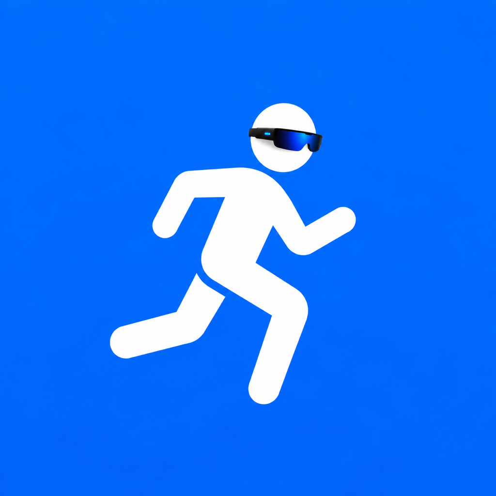

  

<h1 align="center">AR-Runner</h1>

  
  

A running app for **Apple Watch** that drives a live heads-up display on
**[ActiveLook](https://www.activelook.net) AR glasses (Engo 2)**. Glance at
your time, heart rate, distance, and pace right in your field of view — no
need to look down at your wrist.

The watch is the primary device. The phone is optional.

## ✨ Features

- **Live AR HUD on your glasses** — elapsed time, heart rate, distance, and
  average pace, updated in real time as you run.
- **Icons for quick scanning** — every metric is paired with an icon so you
  can read your stats at a glance, mid-stride.
- **Persistent finish screen** — when you tap Finish, your time and distance
  stay up on the glasses until your next workout.
- **HealthKit workout recording** — runs are saved as standard workouts in
  the Health app, just like the built-in Workout app.
- **Strava integration** — connect your account once and finished runs upload
  automatically.
- **Action Button support** *(Apple Watch Ultra)* — start a workout, mark
  splits, and pause or resume without touching the screen.
- **Smart Stack widget** — launch straight into a run from your watch face's
  Smart Stack.
- **Optional iPhone companion** — pair your phone to mirror live metrics on
  a bigger screen and see your glasses' battery level.

## 📋 Requirements

- **Apple Watch** running watchOS 11 or later
  - Apple Watch Ultra recommended for Action Button support
- **ActiveLook-compatible AR glasses** (tested with [Engo 2](https://engoeyewear.com))
- **iPhone** running iOS 18 or later — *optional*, only needed for the
  companion app and Strava setup

> AR-Runner is currently in **TestFlight beta**. Join the beta to install.

## 🚀 Getting Started

1. **Install from TestFlight** — request access and install AR-Runner on
   your Apple Watch (and optionally your iPhone).
2. **Pair your glasses** — open the watch app, put your Engo 2 in pairing
   mode, and tap your glasses in the list. You only need to do this once.
3. **Start a run** — tap Start (or press the Action Button on Ultra). The
   HUD lights up on your glasses automatically.
4. **Finish when you're done** — tap Finish. Your time and distance stay on
   the glasses, the run lands in Health, and uploads to Strava if connected.

## 🛠 For Developers

Want to build from source or contribute? Start here:

- [Build from source](docs/dev/setup.md)
- [CI workflows](docs/dev/ci-workflows.md)
- [Architecture overview](docs/planning/architecture.md)
- [Contributing guide](CONTRIBUTING.md)

## 📄 License

Apache 2.0 — see [LICENSE](LICENSE).

---

AR-Runner is built by a small AI team coordinated with
[Squad](https://github.com/bradygaster/squad).
