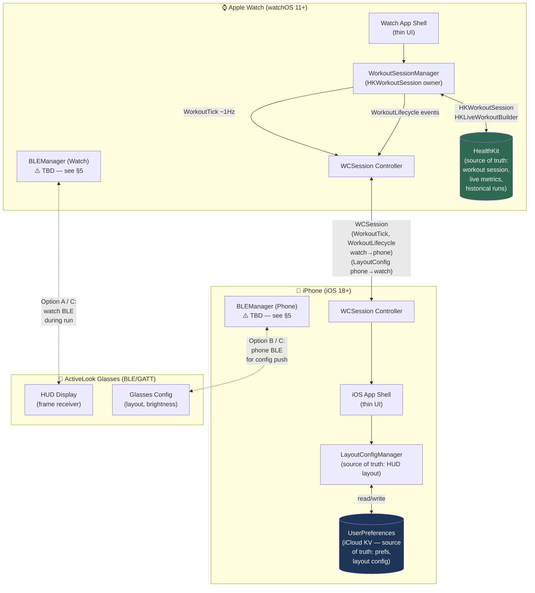

# AR-Runner — System Architecture Plan

**Author:** Richards (Lead / Architect)  
**Date:** 2026-05-14T15:03:23-04:00  
**Status:** Draft — pending input from Weiss (ActiveLook SDK), Laughlin (watchOS arch), Killian (product brief)  
**Version:** 0.1

---

## 1. System Diagram



> **State ownership at a glance:**
> - 🟢 **HealthKit** (Watch) — workout session, live metrics, historical runs
> - 🔵 **iCloud KV / UserPreferences** (Phone) — HUD layout config, user preferences
> - ⚠️ **BLE connection owner** — TBD pending Weiss + Laughlin joint call (see §3, §5)

---

## 2. Component Breakdown — Swift Package Layout

### Proposal: `ARRunnerCore` Shared SPM Package + Thin App Shells

```
AR-Runner/
├── ARRunnerCore/                   # Shared SPM package
│   ├── Package.swift
│   └── Sources/
│       └── ARRunnerCore/
│           ├── Models/
│           │   ├── WorkoutMetrics.swift      # HKQuantity wrappers, pace, HR, cadence
│           │   ├── LayoutConfig.swift         # HUD layout definition (Codable)
│           │   └── UserPreferences.swift      # App-wide prefs (Codable)
│           ├── WorkoutStateMachine/
│           │   ├── WorkoutState.swift         # enum: idle/active/paused/ended
│           │   ├── WorkoutEvent.swift         # enum: start/pause/resume/end/tick
│           │   └── WorkoutStateMachine.swift  # pure Swift, no UIKit/WatchKit deps
│           ├── GlassesFrameProtocol/
│           │   ├── GlassesFrame.swift         # Frame model (Codable)
│           │   ├── FrameBuilder.swift         # Composes metrics → frame
│           │   └── ActiveLookCommands.swift   # GATT command constants (⚠️ Weiss to validate)
│           └── WCSessionContract/
│               ├── WCMessage.swift            # Versioned message envelope
│               ├── LayoutConfigMessage.swift
│               ├── WorkoutTickMessage.swift
│               └── WorkoutLifecycleMessage.swift
│
├── AR-Runner-Watch/                # watchOS app shell
│   ├── AR_Runner_Watch.xcodeproj (or via workspace)
│   └── Sources/
│       ├── WorkoutSessionManager.swift   # HKWorkoutSession, delegates to core state machine
│       ├── BLEManager.swift              # Watch-side BLE (Option A or C)
│       ├── WCSessionController.swift     # Watch-side WCSession, uses core messages
│       └── Views/                        # SwiftUI / WatchKit views
│
├── AR-Runner-iOS/                  # iOS app shell
│   ├── AR_Runner_iOS.xcodeproj (or via workspace)
│   └── Sources/
│       ├── LayoutConfigManager.swift     # Owns HUD layout, syncs to iCloud KV
│       ├── BLEManager.swift              # Phone-side BLE (Option B or C)
│       ├── WCSessionController.swift     # Phone-side WCSession, uses core messages
│       └── Views/                        # SwiftUI views
│
└── AR-Runner.xcworkspace           # Unifies both app targets + ARRunnerCore
```

### Justification

| Concern | SPM-first shared core | Alternative: duplicate models per target |
|---|---|---|
| Model drift | ✅ Single source — `WorkoutMetrics`, `LayoutConfig` identical on both sides | ❌ Inevitable divergence |
| State machine testability | ✅ Pure Swift, no platform deps → easy unit tests | ❌ Harder to isolate |
| BLE / HealthKit platform code | ✅ Stays in thin shells where framework deps live | same |
| Xcode project complexity | Moderate — workspace needed | Slightly simpler initially |
| Onboarding clarity | ✅ Clear bounded contexts | ❌ Muddier |

**Recommendation:** SPM-first shared core is the right call for this project size and cross-device symmetry. Thin shells keep platform-specific frameworks (HealthKit, WatchConnectivity, CoreBluetooth) out of the shared layer.

**Alternative considered:** A single Xcode project with shared Swift files via group references. Rejected — no package-level testability, no clean dependency graph.

> ⚠️ **Input needed from Weiss:** Confirm whether the ActiveLook SDK ships as an SPM package, XCFramework, or CocoaPod. This affects whether `ActiveLookCommands.swift` wraps a vendored SDK or talks raw GATT directly.

---

## 3. State Ownership

| State | Owner | Mechanism | Notes |
|---|---|---|---|
| **Workout session** (active/paused/ended) | ⌚ Watch | `HKWorkoutSession` + `WorkoutStateMachine` in core | Watch is authoritative; phone receives lifecycle events via WCSession |
| **Live metrics** (HR, pace, cadence, distance) | ⌚ Watch | `HKLiveWorkoutBuilder` | Ticked to phone ~1Hz via `WorkoutTick` message |
| **Historical runs** | ⌚ Watch / HealthKit | `HKHealthStore` | Readable by iPhone via HealthKit sharing; no custom sync needed |
| **HUD layout config** | 📱 Phone | `LayoutConfigManager` + iCloud KV | Phone is authoritative; pushes to watch via `LayoutConfig` message pre-run |
| **User preferences** (units, alerts, display) | 📱 Phone | `UserPreferences` + iCloud KV | iCloud KV gives free multi-device sync; watch reads a local copy synced at launch |
| **BLE connection to glasses** | ⚠️ **TBD** | See §5 | Joint call needed with Weiss (SDK constraints) and Laughlin (watch radio budget) |
| **Glasses frame state** | 🥽 Glasses | Maintained by glasses firmware | We only push frames; glasses own render state |

### Open calls (flagged for Joe)
- iCloud KV vs Core Data CloudKit for preferences — KV is sufficient unless we need rich history
- Whether historical run data lives purely in HealthKit or we maintain a shadow store for richer run analytics

---

## 4. Cross-Device Protocol — WCSession Message Contract

### Design Principles
- All messages are `Codable` structs in `ARRunnerCore` — no stringly-typed dictionaries
- Messages carry a `schemaVersion: Int` for forward compatibility
- The watch is the sender of workout data; the phone is the sender of config
- `sendMessage(_:replyHandler:)` for latency-sensitive paths; `transferUserInfo` for fire-and-forget config

### Message Types

#### `LayoutConfigMessage` — Phone → Watch
**Frequency:** Infrequent (pre-run, on config change)  
**Transport:** `transferUserInfo` (queued, reliable)

```swift
struct LayoutConfigMessage: Codable {
    let schemaVersion: Int          // currently 1
    let messageType: String         // "layoutConfig"
    let config: LayoutConfig        // HUD slot definitions, font size, units
    let sentAt: Date
}
```

#### `WorkoutTickMessage` — Watch → Phone
**Frequency:** ~1 Hz during active workout  
**Transport:** `sendMessage` (requires reachable session)

```swift
struct WorkoutTickMessage: Codable {
    let schemaVersion: Int          // currently 1
    let messageType: String         // "workoutTick"
    let heartRate: Double?          // bpm
    let pace: Double?               // sec/km or sec/mi
    let cadence: Double?            // steps/min
    let distance: Double?           // meters, cumulative
    let elapsedSeconds: Int
    let timestamp: Date
}
```

#### `WorkoutLifecycleMessage` — Watch → Phone (and reverse for remote control)
**Frequency:** Sparse (start, pause, resume, end)  
**Transport:** `sendMessage` with reply handler for ack

```swift
enum WorkoutLifecycleEvent: String, Codable {
    case started, paused, resumed, ended, gpsSampleBegin
}

struct WorkoutLifecycleMessage: Codable {
    let schemaVersion: Int          // currently 1
    let messageType: String         // "workoutLifecycle"
    let event: WorkoutLifecycleEvent
    let workoutID: UUID             // ties ticks to this session
    let timestamp: Date
}
```

### Versioning Strategy
- `schemaVersion` is an `Int` monotonically incremented per breaking field change
- Receivers must handle unknown versions gracefully (log + ignore unknown fields, not crash)
- Non-breaking additions (new optional fields) do **not** increment `schemaVersion`
- Breaking changes require a version bump and a compatibility shim for one release cycle
- Version compatibility table lives in `WCMessage.swift` as inline documentation

> ⚠️ **Input needed from Laughlin:** Confirm WCSession reachability assumptions during `HKWorkoutSession` — some background execution modes may limit `sendMessage` frequency. May need to fall back to `transferUserInfo` or `updateApplicationContext` during low-power.

---

## 5. Glasses BLE Strategy — Three Options

### Option A — Watch-Only BLE During Workout (Phone Disconnects)

```
[Watch] ──BLE/GATT──▶ [Glasses]
[Phone] ✗ (disconnected from glasses during run)
```

**Pros:**
- Watch drives the full loop: HealthKit metrics → frame builder → GATT push. No relay latency.
- Simpler code path during the hot path (no WCSession in frame critical path).
- Phones may exceed BLE range during a run (armband, pocket, bag).

**Cons:**
- Watch BLE radio competes with `HKWorkoutSession` — Apple's radio arbitration is undocumented and may cause frame drops.
- ActiveLook SDK may not have a watch-native (watchOS) version — **Weiss must confirm.**
- Watch battery impact: BLE + HealthKit + GPS simultaneously.
- Config changes mid-run (from phone) require a WCSession relay back through watch → glasses.

---

### Option B — Phone-Only BLE, Watch Relays Metrics via WCSession

```
[Watch] ──WCSession (~1Hz)──▶ [Phone] ──BLE/GATT──▶ [Glasses]
```

**Pros:**
- Phone's BLE stack is more powerful, better documented, more SDK support.
- Watch radio load reduced — watch only does HealthKit + GPS + WCSession.
- Phone can directly push config changes to glasses at any time.
- Simpler if ActiveLook SDK is iOS-only (likely — **Weiss to confirm**).

**Cons:**
- Adds ~WCSession round-trip latency to the HUD update path (typically 50–200ms extra).
- If WCSession drops (phone out of range, background state), glasses HUD goes stale.
- Phone must stay running and in BLE range of glasses during entire run — constraint on how user carries phone.
- Two hops = two failure points.

---

### Option C — Hybrid: Phone Owns Config Push at Start, Watch Owns Live Frames During Run

```
[Phone] ──BLE (pre-run config)──▶ [Glasses]
[Watch] ──BLE (live frames, ~1Hz during run)──▶ [Glasses]
```

**Pros:**
- Separates concerns cleanly: phone handles infrequent config, watch handles high-frequency frames.
- Removes phone from the hot path (no WCSession latency on frames).
- Graceful degradation: if phone disconnects post-handoff, watch continues unaffected.

**Cons:**
- Most complex — requires BLE handoff protocol between phone and watch.
- Both devices must be able to connect to glasses (requires ActiveLook SDK on watchOS — TBD).
- BLE dual-master to glasses may not be supported by ActiveLook firmware — **Weiss must confirm.**
- More edge cases: what if handoff fails? who's connected at pause/resume?

---

### 🏆 Recommendation: **Option B for v0.1, with Option C as the v1 target**

**Rationale:**
1. ActiveLook SDK almost certainly ships iOS-first. Building on Option A or C requires confirming a watchOS SDK exists — we shouldn't block on that assumption.
2. Option B is the safest path to a working prototype: phone BLE is well-understood, SDK support is guaranteed on iOS.
3. The extra WCSession latency (~100ms) is acceptable for a HUD that updates at 1Hz — users won't perceive it.
4. Option C's clean architecture is the right long-term answer, but only after Weiss confirms BLE dual-master feasibility and watchOS SDK availability.

> ⚠️ **Joint call required:** Weiss + Laughlin + Richards must align on BLE ownership before any BLE code is written. This is the single highest-risk architectural decision in the system.

---

## 6. Build / Tooling Decisions

### Xcode Project vs SPM-First

**Decision: SPM-first for `ARRunnerCore`, Xcode workspace for app targets.**

`ARRunnerCore` is a pure Swift package — `swift build`, `swift test`, no Xcode required for CI on the shared layer. App shells need Xcode project files for entitlements, signing, WatchKit extensions, and HealthKit capabilities.

Workspace structure:
```
AR-Runner.xcworkspace
├── AR-Runner-iOS (Xcode project)
├── AR-Runner-Watch (Xcode project)
└── ARRunnerCore (local SPM package, referenced via file://)
```

### Minimum OS Targets

| Platform | Minimum | Rationale |
|---|---|---|
| watchOS | **11.0** | `HKWorkoutSession` modern API, App Intents for Action Button (watchOS 11), swift concurrency on-watch |
| iOS | **18.0** | Matches watchOS 11 companion requirement; Control Center widgets, App Intents improvements |
| Swift | **6.0** | Strict concurrency — catches data races at compile time, critical for BLE + HealthKit async paths |

> ⚠️ **Joe's call:** Dropping to watchOS 10 / iOS 17 widens the addressable market but loses App Intents on Action Button (Laughlin's concern). Recommend 11/18 unless Joe has a specific reason to go lower.

### CI Thoughts (flag for later)

Not scaffolding CI now — flagging decisions needed when we get there:
- `xcodebuild` on macOS-latest GitHub Actions runner for iOS/watchOS builds (expensive minutes)
- `swift test` on Linux runner for `ARRunnerCore` unit tests (cheap, fast)
- TestFlight distribution via Fastlane or Xcode Cloud
- Physical device required for BLE + HealthKit integration tests — no simulator path

---

## 7. Risk Register

| # | Risk | Likelihood | Impact | Mitigation |
|---|---|---|---|---|
| **R1** | **BLE signal degradation** — sweat, glove occlusion, wrist rotation break GATT connection mid-run | Medium | High | Implement reconnect-with-retry loop in `BLEManager`; cache last-known frame on glasses so display doesn't blank; test with actual workout conditions early |
| **R2** | **Watch BLE radio contention with HKWorkoutSession** — Apple's radio arbitration may throttle BLE when GPS + HealthKit are active | Medium | High | Prototype watch-direct BLE early (even if Option B is v0.1 plan); measure frame delivery rate under load; have Option B as guaranteed fallback |
| **R3** | **App Intent / Action Button cannot launch app in background** — watchOS App Intent may require foreground; user must start run from watch face first | Medium | Medium | Laughlin to prototype Action Button → workout start flow; document workaround (complication tap as alternative launch); may be resolved by `ProvidesWorkoutSessionUserActivity` entitlement |
| **R4** | **Glasses frame budget exceeded at 1Hz** — ActiveLook glasses may have GATT throughput or render frame limits below our assumed 1Hz | Low–Medium | High | Weiss to benchmark GATT write throughput and glasses render FPS; design `FrameBuilder` to be throttleable (configurable tick rate); consider delta encoding (only send changed fields) |
| **R5** | **iCloud KV sync race condition** — layout config changed on phone while watch is mid-run; stale config on glasses | Low | Medium | Config is immutable for the duration of a workout session — lock config at `WorkoutLifecycle.started`, unlock at `.ended`; phone shows "will apply on next run" UX if changed mid-run |

---

## 8. Decision Points for Joe

The following architectural calls are **blockers for scaffolding code**. I need answers before we write production structure.

> **D1 — BLE Ownership: Option A, B, or C?**  
> My recommendation is Option B for v0.1 (phone-only BLE). But this must be confirmed after Weiss reports on the ActiveLook SDK platform support. Do you want to wait for Weiss's output, or pre-commit to Option B now and pivot if needed?

> **D2 — Minimum OS Targets: watchOS 11 / iOS 18, or lower?**  
> watchOS 11 / iOS 18 gives us App Intents for Action Button launch and modern swift concurrency. Dropping to watchOS 10 / iOS 17 broadens market reach but loses the Action Button feature Laughlin is designing around. What's your call?

> **D3 — User Preferences Persistence: iCloud KV or CloudKit (Core Data)?**  
> iCloud KV is dead simple and sufficient for key preferences (units, layout config). CloudKit with Core Data unlocks richer run history sync but adds significant complexity. For v0.1, KV is my recommendation — confirm or override.

> **D4 — Historical Run Storage: HealthKit-only or shadow store?**  
> HealthKit stores workout data natively and the iPhone Health app provides free visualization. A shadow store (Core Data + CloudKit) would let us build custom analytics, shareable run summaries, and richer history. Is custom run history in scope for v0.1 / v1? Killian's brief should inform this — flagging for alignment.

> **D5 — Single Xcode Workspace vs Separate Projects?**  
> My proposal: one `.xcworkspace` with iOS app, watchOS app, and `ARRunnerCore` SPM package. The alternative is a single Xcode project with multiple targets. The workspace approach is cleaner for an SPM-first strategy but adds a small setup step. Any objection to the workspace layout?

> **D6 — Swift 6 Strict Concurrency: Yes or soft-start with warnings?**  
> Swift 6 strict concurrency will catch real bugs in our async BLE + HealthKit code at compile time, but it requires careful actor modeling from day one. The alternative is Swift 5.10 with concurrency warnings enabled but not errors. Given greenfield start, I recommend committing to Swift 6 now — confirm?

> **D7 — ActiveLook SDK Integration: wait for Weiss or make assumptions?**  
> Weiss is documenting ActiveLook's repos now. Should I scaffold `GlassesFrameProtocol` as an abstract protocol (swap-in implementation later) so the rest of the codebase compiles without the SDK? This lets Laughlin and others start work before the BLE strategy is locked. My recommendation: yes, abstract it.

---

## Appendix: Open Inputs from Teammates

| Item | Needed From | Blocks |
|---|---|---|
| ActiveLook SDK platform support (iOS? watchOS? SPM?) | Weiss | BLE strategy (§5), `GlassesFrameProtocol` (§2) |
| ActiveLook GATT frame budget / max write frequency | Weiss | Frame rate design (R4), `FrameBuilder` design |
| WCSession reachability during `HKWorkoutSession` | Laughlin | WorkoutTick transport choice (§4) |
| App Intent / Action Button background launch capability | Laughlin | R3 mitigation |
| v0.1 MVP scope — is run history / social features in v0.1? | Killian | D4 (shadow store decision) |
